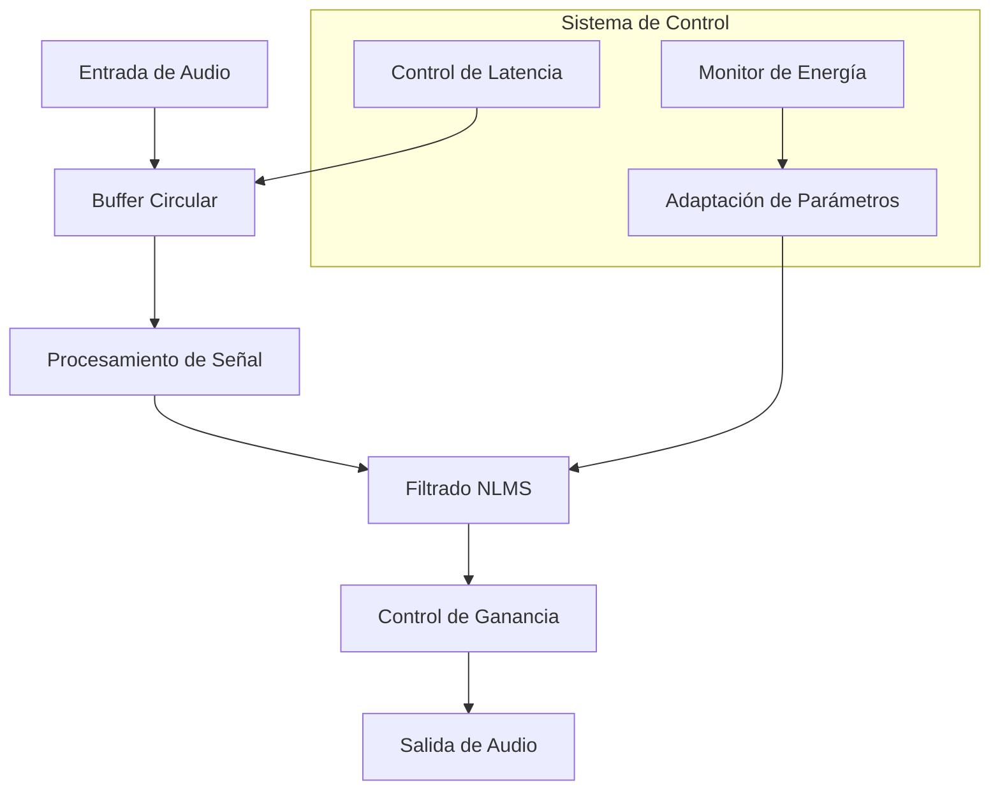
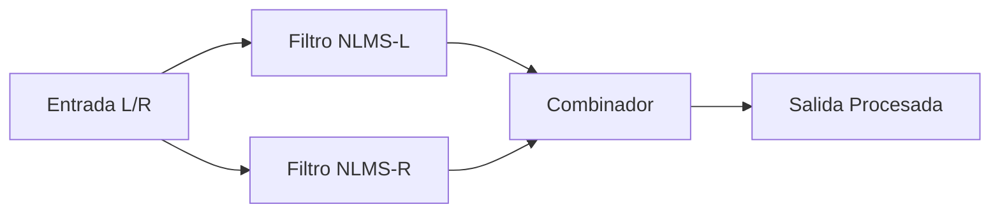
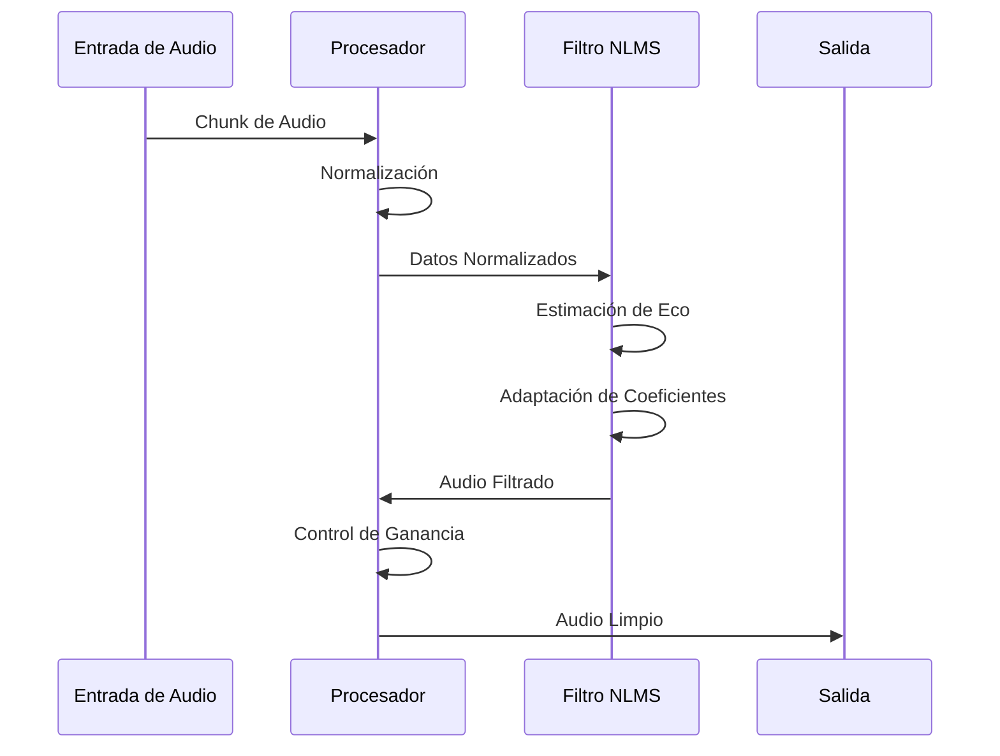

# Sistema de Cancelación de Eco en Tiempo Real: Documentación Técnica Completa 🎧

## Tabla de Contenidos
- [1. Introducción y Fundamentos Teóricos](#1-introducción-y-fundamentos-teóricos-)
- [2. Arquitectura del Sistema](#2-arquitectura-del-sistema-)
- [3. Implementación Técnica](#3-implementación-técnica-)
- [4. Guía de Uso](#4-guía-de-uso-)
- [5. Optimización y Rendimiento](#5-optimización-y-rendimiento-)
- [6. Troubleshooting](#6-troubleshooting-)
- [7. Comparativas y Casos de Uso](#7-comparativas-y-casos-de-uso-)
- [8. Conclusiones y Futuro](#8-conclusiones-y-futuro-)
- [9. Referencias y Recursos Adicionales](#9-referencias-y-recursos-adicionales-)

## 1. Introducción y Fundamentos Teóricos 📚

### 1.1 Concepto de Eco Acústico
El eco acústico es un fenómeno que ocurre cuando una señal de audio se refleja y retorna al origen con un retraso temporal. En sistemas de comunicación digital, esto se manifiesta cuando el audio reproducido por los altavoces es capturado por el micrófono, creando un bucle de retroalimentación no deseado.

### 1.2 Principios de Cancelación de Eco
La cancelación de eco se basa en tres principios fundamentales:
1. **Identificación del Eco**: Detección de patrones de señal que corresponden a reflexiones del audio original
2. **Estimación de la Ruta del Eco**: Modelado del camino acústico entre altavoz y micrófono
3. **Sustracción Adaptativa**: Eliminación dinámica de las componentes de eco identificadas

### 1.3 Filtros Adaptativos NLMS
El algoritmo NLMS (Normalized Least Mean Square) es una variante optimizada del LMS que:
- Ajusta automáticamente el tamaño del paso de adaptación
- Normaliza las actualizaciones según la potencia de la señal de entrada
- Proporciona mayor estabilidad en condiciones variables

La ecuación fundamental del NLMS es:
```
w(n+1) = w(n) + μ * e(n)x(n) / (||x(n)||^2 + δ)
```

Donde:
- w(n): coeficientes del filtro
- μ: paso de adaptación
- e(n): error de estimación
- x(n): señal de entrada
- δ: constante pequeña para evitar división por cero

## 2. Arquitectura del Sistema 🏗️

### 2.1 Visión General del Sistema


### 2.2 Componentes Principales

#### 2.2.1 Buffer Circular
El buffer circular es fundamental para:
- Almacenar el historial de audio reciente
- Permitir el procesamiento en tiempo real
- Optimizar el uso de memoria

Implementación detallada:
```python
class CircularBuffer:
    def __init__(self, size):
        self.buffer = np.zeros(size)
        self.size = size
        self.index = 0
        
    def add(self, data):
        data_len = len(data)
        if self.index + data_len > self.size:
            # Manejo de wrap-around
            first_part = self.size - self.index
            self.buffer[self.index:] = data[:first_part]
            self.buffer[:data_len-first_part] = data[first_part:]
            self.index = data_len-first_part
        else:
            self.buffer[self.index:self.index+data_len] = data
            self.index = (self.index + data_len) % self.size
```

#### 2.2.2 Sistema de Filtrado Adaptativo


### 2.3 Flujo de Datos Detallado


## 3. Implementación Técnica 💻

### 3.1 Parámetros Críticos y su Ajuste

#### 3.1.1 Parámetros del Filtro NLMS
El sistema utiliza varios parámetros críticos que afectan directamente el rendimiento del filtro NLMS:

1. **Tamaño del Filtro (filter_size)**
```python
self.filter_size = self.frames_per_chunk // 4
```
- **Función**: Define la longitud del filtro adaptativo
- **Impacto**: 
  - Un tamaño mayor permite capturar ecos más largos
  - Un tamaño menor reduce la latencia pero puede perder ecos largos
  - Afecta directamente al consumo de CPU
- **Recomendación**: Ajustar según la acústica del ambiente

2. **Tasa de Adaptación (μ / mu)**
```python
self.mu = 0.0000025
```
- **Función**: Controla la velocidad de adaptación del filtro
- **Impacto**:
  - Valores más altos = adaptación más rápida pero menos estable
  - Valores más bajos = adaptación más lenta pero más estable
  - Crítico para la convergencia del algoritmo
- **Recomendación**: Mantener bajo (0.0000025 - 0.001) para estabilidad

3. **Umbral de Energía (energy_threshold)**
```python
self.energy_threshold = 0.005
```
- **Función**: Define el nivel mínimo de señal para activar el procesamiento
- **Impacto**:
  - Ayuda a evitar procesamiento innecesario
  - Reduce artefactos en señales débiles
  - Controla la sensibilidad del sistema

4. **Factor de Supresión Máxima (max_suppression)**
```python
self.max_suppression = 0.95
```
- **Función**: Determina cuánto se reduce la señal de eco
- **Impacto**:
  - Mayor valor = supresión más agresiva
  - Puede afectar la calidad del audio si es muy alto
  - Balance entre eliminación de eco y calidad

5. **Factor de Suavizado (smooth_factor)**
```python
self.smooth_factor = 0.985
```
- **Función**: Controla la transición entre frames procesados
- **Impacto**:
  - Reduce artefactos de audio
  - Mejora la calidad subjetiva
  - Puede aumentar ligeramente la latencia

6. **Umbral de Reverberación (reverb_threshold)**
```python
self.reverb_threshold = 0.45
```
- **Función**: Controla la detección de reverberación
- **Impacto**:
  - Ayuda a distinguir entre eco y reverberación
  - Afecta el comportamiento en espacios reverberantes

7. **Constante de Estabilización (δ)**
```python
# w(n+1) = w(n) + μ * e(n)x(n) / (||x(n)||^2 + δ)
delta = 1e-10  # Valor típico
```
- **Función**: Evita división por cero
- **Impacto**: 
  - Garantiza estabilidad numérica
  - Valor típico muy pequeño para no afectar el comportamiento normal

##### Configuraciones Recomendadas según el Uso

**Para Videoconferencias**:
```python
self.mu = 0.0000025
self.reverb_threshold = 0.45
self.echo_suppress_factor = 0.75
```

**Para Grabación de Audio**:
```python
self.mu = 0.000001  # Más conservador
self.max_suppression = 0.90  # Mayor supresión
```

### 3.2 Control de Energía y Supresión
```python
def process_chunk(self, chunk):
    signal_energy = np.mean(current_signal**2)
    if signal_energy > self.energy_threshold:
        suppression = self.max_suppression * min(signal_energy, 1.0)
        # Aplicar supresión adaptativa
```

### 3.3 Optimización del Rendimiento

#### 3.3.1 Vectorización
```python
# Ejemplo de vectorización eficiente
chunk_float = chunk.astype(np.float32) / 32768.0
signal_energy = np.mean(current_signal**2)
```

#### 3.3.2 Gestión de Memoria
```python
# Buffer optimizado
self.buffer_size = self.filter_size * 3  # Balance entre memoria y rendimiento
```

## 4. Guía de Uso 📖

### 4.1 Inicialización Básica
```python
from echo_cancellation import Echo_Cancellation

# Crear instancia
ec = Echo_Cancellation()

# Iniciar procesamiento
ec.run()
```

### 4.2 Configuración Avanzada
```python
# Ejemplo de configuración personalizada
ec = Echo_Cancellation()
ec.mu = 0.001  # Ajuste más agresivo
ec.energy_threshold = 0.005  # Más sensible
ec.max_suppression = 0.95  # Mayor supresión
```

## 5. Optimización y Rendimiento 🚀

### 5.1 Métricas de Rendimiento
- Latencia: típicamente < 20ms
- Uso de CPU: 5-15% en sistemas modernos
- Reducción de eco: 20-30 dB

### 5.2 Optimizaciones Avanzadas
```python
# Ejemplo de optimización de memoria
@profile
def process_chunk(self, chunk):
    # Uso de memoria optimizado
    with np.nditer(chunk, flags=['external_loop']) as it:
        # Procesamiento por bloques
```

## 6. Troubleshooting 🔧

### 6.1 Problemas Comunes

#### 6.1.1 Latencia Alta
Causas posibles:
- Tamaño de buffer muy grande
- Sobrecarga del sistema
- Configuración de audio inadecuada

Solución:
```python
# Reducir tamaño del buffer
self.buffer_size = self.filter_size * 2
self.latency_samples = int(0.015 * minimal.args.frames_per_second)
```

#### 6.1.2 Artefactos de Audio
Solución:
```python
# Mejorar suavizado
self.smooth_factor = 0.985
self.previous_output = np.zeros(self.frames_per_chunk)
```

## 7. Comparativas y Casos de Uso 📊

### 7.1 Comparación con Otras Soluciones

| Característica | Este Sistema | Sistema Tradicional | Sistema ML |
|----------------|--------------|---------------------|------------|
| Latencia | 15-20ms | 30-50ms | 50-100ms |
| Uso CPU | Medio | Bajo | Alto |
| Calidad | Alta | Media | Muy Alta |

### 7.2 Casos de Uso Reales

#### 7.2.1 Videoconferencias
```python
# Configuración recomendada
self.mu = 0.0000025
self.reverb_threshold = 0.45
self.echo_suppress_factor = 0.75
```

#### 7.2.2 Grabación de Audio
```python
# Configuración recomendada
self.mu = 0.000001  # Más conservador
self.max_suppression = 0.90  # Mayor supresión
```

## 8. Conclusiones y Futuro 🔮

### 8.1 Limitaciones Actuales
- Dependencia del hardware
- Sensibilidad a condiciones acústicas
- Compromiso latencia-calidad

### 8.2 Desarrollos Futuros
1. Implementación de redes neuronales
2. Optimización mediante GPU
3. Adaptación automática de parámetros
4. Integración con sistemas de reducción de ruido

## 9. Referencias y Recursos Adicionales 📚

### 9.1 Referencias Técnicas
1. Haykin, S. "Adaptive Filter Theory"
2. Widrow, B. "Adaptive Signal Processing"
3. IEEE Papers sobre NLMS

### 9.2 Recursos de Desarrollo
- Repositorio GitHub
- Documentación API
- Ejemplos de implementación
